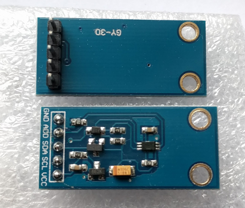
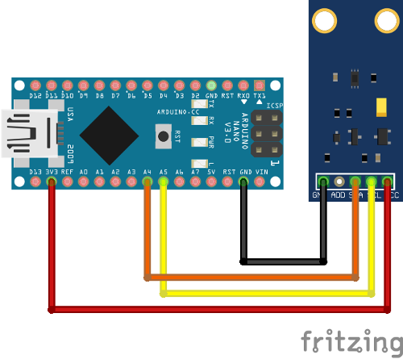

# BH1750

[](https://travis-ci.org/claws/BH1750)<br>

This package contains an Arduino library for digital light sensor breakout boards containing the
BH1750FVI IC.

The BH1750 board uses I2C for communication which requires two pins to
communicate with the device. Configuring the I2C bus must be done in user code
(not library code). This approach has been adopted so it can be done once and
will better support the various options for different platforms.

A common module containing the BH1750 component is the GY-30 shown below.




## Overview

The BH1750 has six different measurement modes which are divided in two groups;
continuous and one-time measurements. In continuous mode the sensor
continuously measures lightness value. In one-time mode, the sensor makes only
one measurement and then goes into Power Down mode.

Each mode has three different precisions:

  - Low Resolution Mode - (4 lx precision, 16ms measurement time)
  - High Resolution Mode - (1 lx precision, 120ms measurement time)
  - High Resolution Mode 2 - (0.5 lx precision, 120ms measurement time)

By default, this library uses Continuous High Resolution Mode, but you can
change this to a different mode by passing the mode argument to
BH1750.begin().

When the One-Time mode is used your sensor will go into Power Down mode when
it completes the measurement and you've read it. When the sensor is powered up
again it returns to the default mode which means it needs to be reconfigured
back into One-Time mode. This library has been implemented to automatically
reconfigure the sensor when you next attempt a measurement so you should not
have to worry about such low level details.

The datasheet for the BH1750 chip can be obtained [here](http://www.elechouse.com/elechouse/images/product/Digital%20light%20Sensor/bh1750fvi-e.pdf)


## Installation

Click "Clone or download" -> "Download ZIP" button.

  - **(For Arduino >= 1.5.x)** Use the way above, or Library Manager. Open Arduino
    IDE, click `Sketch -> Include library -> Add .ZIP library ` and select the
    downloaded archive.

  - **(For Arduino < 1.5.x)** Extract the archive to
    ``<Your User Directory>/My Documents/Arduino/libraries/`` folder and rename it
    to `BH1750`. Restart IDE.

The following YouTube [video](https://youtu.be/ACTMQvPVMLs) (specifically from
7:20 onwards) provides a good overview of installing this library and loading
an example using the Arduino IDE.

[](https://youtu.be/ACTMQvPVMLs?t=437)

Additional info, about library installation process - https://www.arduino.cc/en/Guide/Libraries


## Example

An example using the BH1750 library in conjunction with the GY-30 board
(which contains the BH1750 component) is presented below. The example
code uses the BH1750 library in the default continuous high precision
mode when making light measurements.

### Wiring

Connections:

  - VCC -> 3V3 or 5V
  - GND -> GND
  - SCL -> SCL (A5 on Arduino Nano, Uno, Leonardo, etc or 21 on Mega and Due, on esp8266 free selectable)
  - SDA -> SDA (A4 on Arduino Nano, Uno, Leonardo, etc or 20 on Mega and Due, on esp8266 free selectable)
  - ADD -> NC/GND or VCC (see below)

The ADD pin is used to set the sensor I2C address. By default (if ADD voltage
less than 0.7 * VCC) the sensor address will be 0x23. If it has voltage
greater or equal to 0.7VCC voltage (e.g. you've connected it to VCC) the
sensor address will be 0x5C.

Wiring up the GY-30 sensor board to an Arduino is shown in the diagram below.



*The image above was created using [Fritzing](http://fritzing.org/home/) and
the GY-30 module was obtained from [here](http://omnigatherum.ca/wp/?p=6)*.

### Code

Upload the BH1750 test code to your Arduino.

``` c++
#include <Wire.h>
#include <BH1750.h>

BH1750 lightMeter;

void setup(){

  Serial.begin(9600);

  // Initialize the I2C bus (BH1750 library doesn't do this automatically)
  // On esp8266 devices you can select SCL and SDA pins using Wire.begin(D4, D3);
  Wire.begin();

  lightMeter.begin();
  Serial.println(F("BH1750 Test"));

}

void loop() {

  uint16_t lux = lightMeter.readLightLevel();
  Serial.print("Light: ");
  Serial.print(lux);
  Serial.println(" lx");
  delay(1000);

}
```

### Output

Moving the sensor to face more light results in the lux measurements increasing.
```
BH1750 Test
Light: 70 lx
Light: 70 lx
Light: 59 lx
Light: 328 lx
Light: 333 lx
Light: 335 lx
Light: 332 lx
```
There are more examples in the examples directory.
